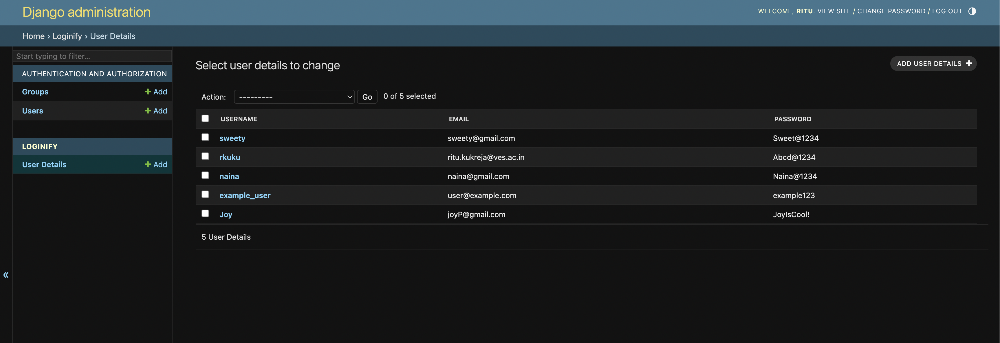
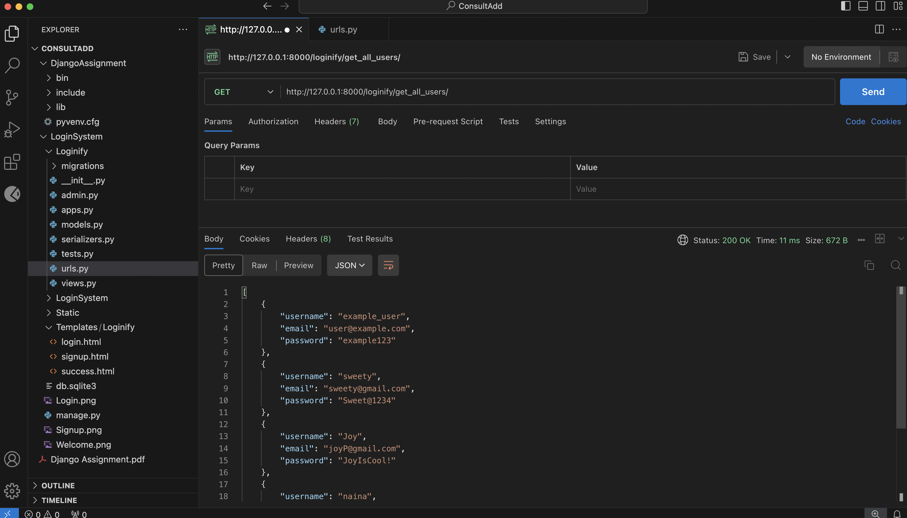
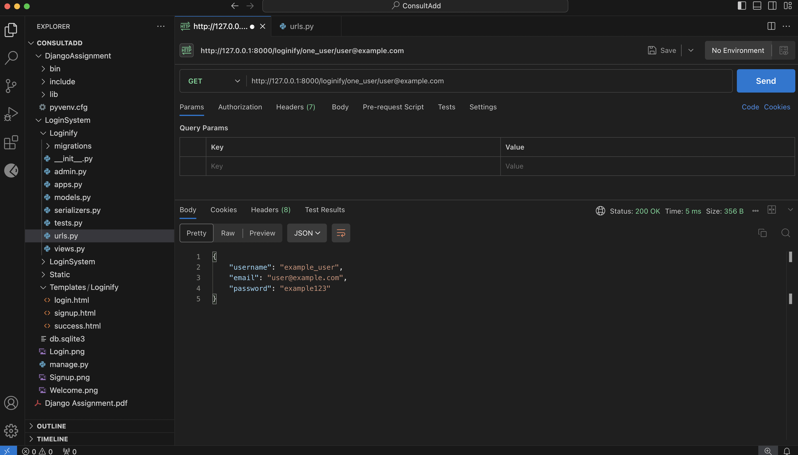
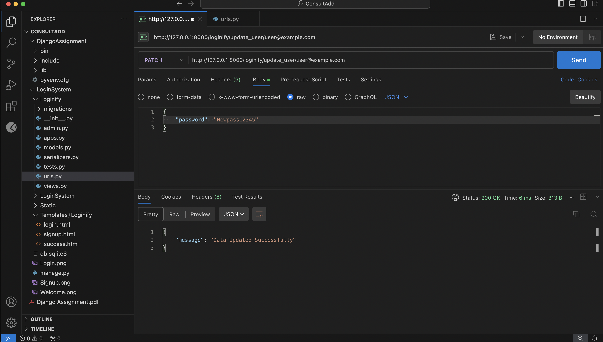
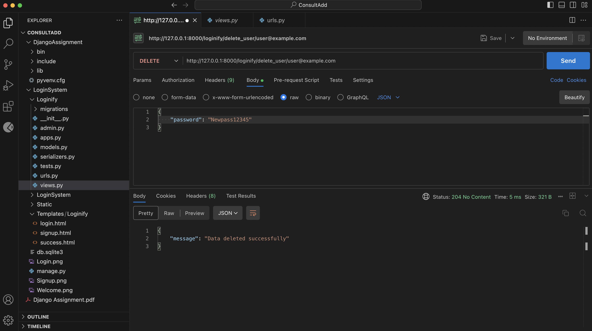

### Project Title: **Login System**

---

### **Project Description**
This Django project is designed to manage user registration, login, and profile information. It allows users to sign up, log in, and perform CRUD operations (Create, Read, Update, Delete) on their account details. It includes the following features:
- User signup with validation for unique email addresses.
- Login functionality with email and password.
- View and manage user profiles, update personal details, and delete accounts.
- Thoroughly tested using Postman for all CRUD operations.

---

### **Technologies Used**
- **Django**: For building the backend, managing models, and rendering templates.
- **HTML/CSS**: For front-end structure and styling.
- **Postman**: For API testing.
- **SQLite**: Default database for data management.

---

### **Project Setup**

#### **1. Create Virtual Environment**
```bash
python -m venv DjangoAssignment
source DjangoAssignment/bin/activate  # macOS/Linux
DjangoAssignment\Scripts\activate  # Windows
```

#### **2. Install Django**
```bash
pip install django
```

#### **3. Create a New Django Project**
```bash
django-admin startproject LoginSystem
```

#### **4. Create a New App**
```bash
python manage.py startapp Loginify
```

#### **5. Run Migrations**
```bash
python manage.py migrate
```

#### **6. Create Superuser**
```bash
python manage.py createsuperuser
```

#### **7. Run the Development Server**
```bash
python manage.py runserver
```

---

### **Features**

#### **1. User Registration (Signup)**
- Form fields for username, email (unique), and password.
- Redirects to login page upon successful signup.

#### **2. User Login**
- Form for email and password input.
- Displays success message after login.

#### **3. Profile Management**
- Users can view and update their details.
- Ability to delete user accounts.

#### **4. CRUD Operations (via API)**
- **Create**: Add new user details.
- **Read**: Retrieve details of all users or a specific user by email.
- **Update**: Modify user details.
- **Delete**: Remove a user by email.

#### **Screenshots**
- **Signup Page**: Display a filled-out form for new user registration.


- **Login Page**: Show the login form.


- **Success Page**: It is a Welcome page.


- **Profile Management Page**: Showcase the user profile details.

  
  
- **Postman CRUD Testing**: Include screenshots of successful API requests (GET, POST, PUT/PATCH, DELETE).

  

  

  

  

---

### **How to Use**

1. **Signup**:
   - Navigate to `loginify/signup/` and fill out the form.
   - After successful registration, you will be redirected to the login page.

2. **Login**:
   - Navigate to `loginify/login/`, enter email and password, and submit.
   - On success, you will be redirected to the success page.

3. **CRUD Operations**:
   - Use Postman to test API endpoints:
     - `loginify/get_all_users/`: Retrieve all user details.
     - `loginify/one_user/<email>/`: Retrieve a single user.
     - `loginify/update_user/<email>/`: Update user details.
     - `loginify/delete_user/<email>/`: Delete a user.

---

### **Commit Messages**
Here are some ideas for commit messages:
- `Initial project setup with Django and virtual environment.`
- `Added user signup and login functionality.`
- `Implemented CRUD operations for user profile management.`
- `Tested API endpoints with Postman.`
- `Styled signup and login pages using CSS.`

This README will guide the user through the project setup, features, usage, and provide an idea of your development process. The screenshots will help showcase the different functionality points.
